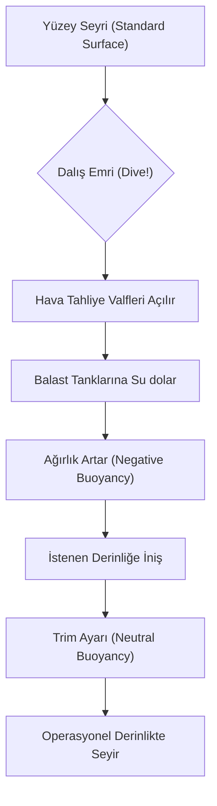

# 0_DOKTRIN: Sualtı Doktrini ve Teorik Temeller

*“Denizaltı, suyun altında hayatta kalmak için fiziğe rüşvet teklif edemeyeceğiniz tek yerdir.”*

## 🏗️ Mühendislik ve Tasarım Prensipleri

Bir denizaltı inşa etmek, doğanın en temel ve en acımasız yasalarından biri olan **hidrostatik basınç** ile hassas insan yaşam alanı arasındaki dengeyi kusursuz bir şekilde kurma sanatıdır. Bu döküman, sualtı hakimiyetinin üzerine inşa edildiği fiziksel sütunları detaylandırır.

### A. Basınç Gövdesi ve Hidrostatik (Pressure Hull Architecture)

Deniz seviyesinden aşağıya doğru atılan her adımda, suyun üzerinizdeki sütun ağırlığı artar. Bu durum, katlanarak artan muazzam bir dış kuvvet doğurur.

*   **Basınç Gradyanı:** Her 10 metre derinlik artışı, basıncı yaklaşık **1 atmosfer (atm) veya 1 bar** artırır.
*   **Kritik Veriler:** 600 metre (operasyonel sınır) derinlikte, denizaltı gövdesi santimetrekare başına yaklaşık **60 kg ($600 N/cm^2$)** yüke maruz kalır. Bu, standart bir otomobilin üzerine binlerce kamyonun binmesi gibidir.
*   **Gövde Geometrisi:** Bu kuvveti her yöne eşit dağıtabilmek için denizaltılar mükemmel bir silindir veya küre şeklinde tasarlanır. Herhangi bir yapısal kusur, basıncın o bölgeye odaklanmasına ve saniyeler içinde "implosion" (iç patlama) gerçekleşmesine neden olur.

---

### B. Arşimet Prensibi ve Yüzerlik Yönetimi (Buoyancy Management)

Bir denizaltı, suyun kaldırma kuvvetini (B) ve kendi ağırlığını (W) manipüle ederek üç farklı durumda bulunabilir:

1.  **Pozitif Yüzerlik ($B > W$):** Denizaltı su yüzeyindedir.
2.  **Nötr Yüzerlik ($B = W$):** Denizaltı suyun içinde askıdadır. Operasyonel durumdur.
3.  **Negatif Yüzerlik ($B < W$):** Denizaltı batmaktadır.

#### 🌊 Dalış Süreci (The Dive Cycle)

---

### C. Balast ve Trim Dinamiği: Hassas Denge

*   **Ana Balast Tankları (MBT):** Denizaltının suyun içine girmesini ve yüzeye çıkmasını sağlayan devasa tanklardır. Dalış sırasında "Yengeçler dışarı, hava dışarı, su içeri!" komutuyla çalışırlar.
*   **Hızlı Dalış Tankları (Quick Dive Tank):** Acil durumlarda veya düşman saldırısından kaçarken, denizaltının hızla negatif yüzerlik kazanarak "derine kaçmasını" sağlayan sistemlerdir.
*   **Trim Tankları:** Mürettebatın öne yürümesi, bir torpidonun ateşlenmesi veya suyun tuzluluk oranının değişmesi (densite farkı) sonucu bozulan dengeyi düzeltmek için kullanılan küçük, hassas kontrol tanklarıdır. Bu tankların yönetimi, sessiz seyirde bile milimetrik doğruluk gerektirir.

### D. Hidrodinamik ve Kontrol Yüzeyleri

Sualtında manevra yapmak, bir uçağın havada uçmasına benzer. 
*   **Yatay Dümenler (Diving Planes):** Denizaltının burnunu yukarı veya aşağı vererek derinlik değiştirmesini sağlar.
*   **Dikey Dümen (Rudder):** Rotayı (yön değişimini) sağlar.
*   **X-Dümen Konfigürasyonu:** Modern denizaltılarda (örn. Type 214, Soryu) kullanılan bu yapı, manevra kabiliyetini artırırken gürültü izini azaltır.

---
*“Sessizliği yöneten, denizi yönetir.”*
