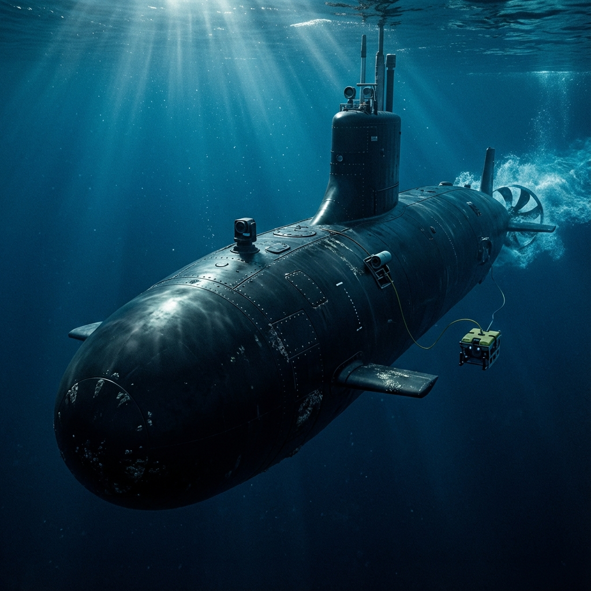

# 🌊 SEAWOLF CLASS (SSN-21) - USA ⚓

**"Soğuk Savaş'ın Sessiz Katili"**

Seawolf sınıfı, Sovyetler Birliği'nin derin okyanus teknolojilerine cevap olarak tasarlanmış, dünyanın en hızlı ve en sessiz saldırı denizaltısıdır.

---

### 🏛️ Teknik Özellikler

| Özellik | Veri |
| :--- | :--- |
| **Uzunluk** | 108 Metre |
| **Derinlik** | 610+ Metre (Operasyonel) |
| **Hız** | 35+ Knot (Su Altı) |
| **Mürettebat** | 140 |
| **Tahrik** | S6W Nükleer Reaktör |

---

### 🚀 Kritik İnovasyonlar

*   **Akustik Sessizlik:** Klasik pervaneler yerine kullanılan **Pump-Jet** itki sistemi ile yüksek hızlarda bile kavitasyon gürültüsünü minimuma indirir.
*   **BİS (Büyük İzole Sistem):** İç makineler, gövdeden kauçuk yalıtkanlarla tamamen izole edilerek sesin dışarı sızması engellenir.
*   **Ağır Arsenal:** 8 adet 660mm torpido kovanı ile devasa bir vuruş gücüne sahiptir.

---

### ⚓ Stratejik Rol
Seawolf'lar, okyanusun derinliklerinde düşman denizaltılarını avlamak ve kritik bölgelerde istihbarat toplamak için "Hunter-Killer" (Avcı-Katil) rolünde görev yaparlar.

---
*Elite Intelligence Hub - 2024*
