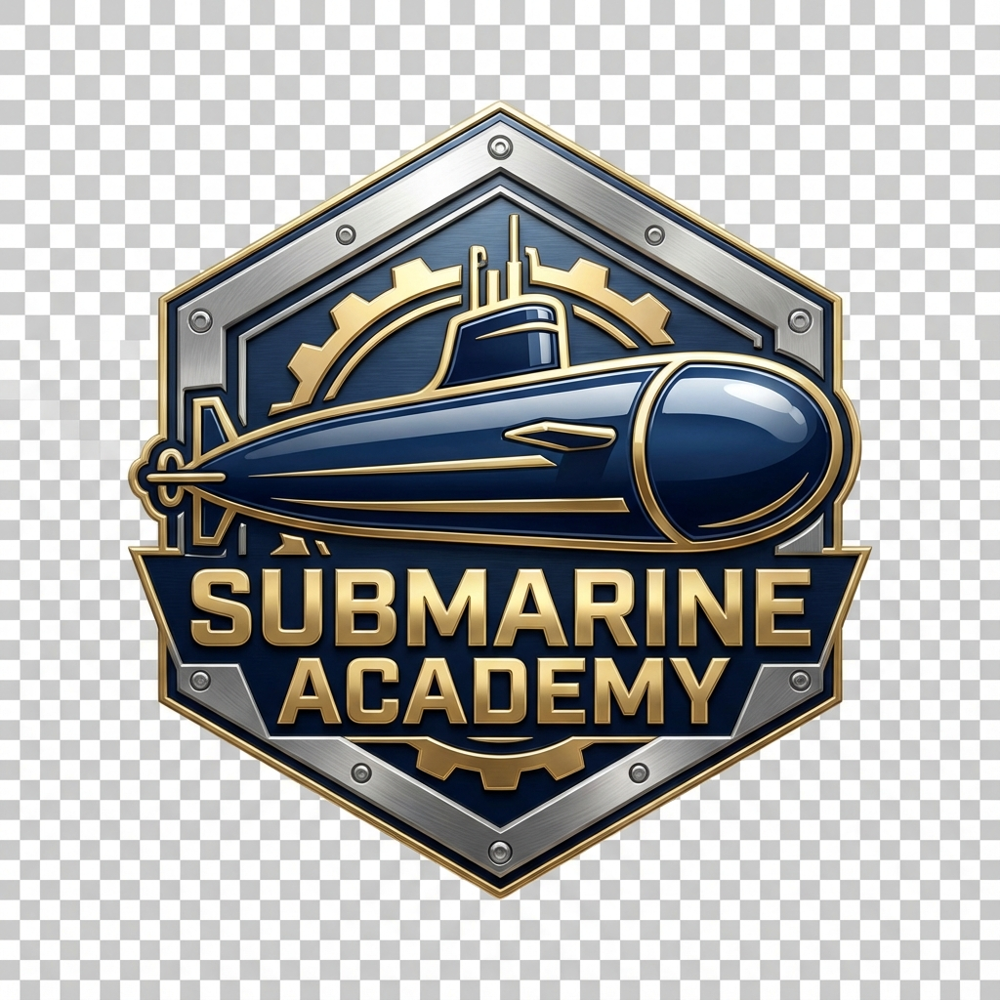
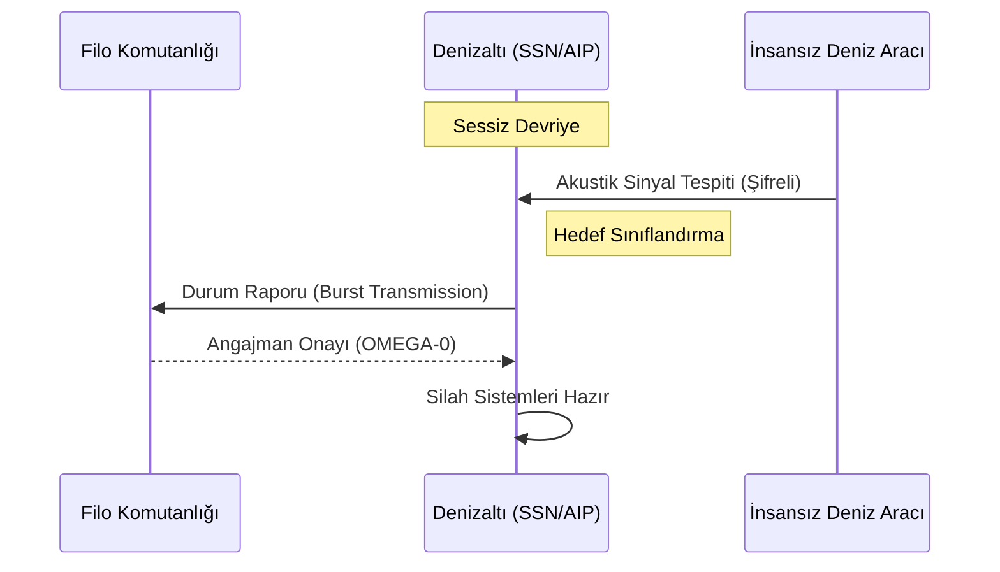



# 🌊 DENİZALTI AKADEMİSİ (SUBMARINE ACADEMY) ⚓

**"Sessiz ve Derinden: Geleceğin Sualtı Teknolojileri Merkezi"**

---

### 🏛️ Stratejik Vizyon (Beka Meselesi)

> *"Donanmamızın güçlü, etkin ve caydırıcı olması bizim için bir tercih değil, bir zorunluluktur, bir **beka meselesidir**."* 🇹🇷 — **TC Cumhurbaşkanlığı**

---

### 🛡️ Operasyonel Komuta Merkezi (Dashboard)

<table align="center">
  <tr>
    <td align="center"><a href="./0_DOKTRIN/STRATEJIK_VIZYON.md"><b>0_DOKTRIN</b></a> 📂 Strateji & Fizik</td>
    <td align="center"><a href="./1_MUHENDISLIK/GOVDE_VE_MALZEME.md"><b>1_MUHENDISLIK</b></a> 📂 Gövde & Basınç</td>
    <td align="center"><a href="./2_SISTEMLER/TAHRIK_VE_AKUSTIK.md"><b>2_SISTEMLER</b></a> 📂 AIP & Nükleer</td>
  </tr>
  <tr>
    <td align="center"><a href="./3_ARSENAL/TORPIDO_VE_FUZE.md"><b>3_ARSENAL</b></a> 📂 Silah & Savunma</td>
    <td align="center"><a href="./4_ISTH_MODERN/MODERN_SINIFLAR.md"><b>4_ISTH_MODERN</b></a> 📂 İstihbarat</td>
    <td align="center"><a href="./5_SISTEM_KARIYER/README.md"><b>5_KARIYER</b></a> 📂 Roadmaps</td>
  </tr>
</table>

---

### 📚 Merkezi Kütüphane ve Dokümantasyon

Tüm operasyonel ve teknik dökümanlara aşağıdaki kütüphane haritasından erişebilirsiniz:

#### 🏛️ [0. Katman: Doktrin & Strateji](./0_DOKTRIN/)
- [**Stratejik Vizyon**](./0_DOKTRIN/STRATEJIK_VIZYON.md): Ulusal beka meselesi ve Mavi Vatan vizyonu.
- [**Doktrin Temelleri**](./0_DOKTRIN/DOKTRIN_TEMELLER.md): Fiziksel kısıtlar ve Arşimet prensipleri.
- [**Operasyonel Protokoller**](./0_DOKTRIN/OPERASYONEL_PROTOKOL.md): Sessiz çalışma ve çatışma prosedürleri.

#### 🏗️ [1. Katman: Mühendislik & Dizayn](./1_MUHENDISLIK/)
- [**Gövde ve Malzeme**](./1_MUHENDISLIK/GOVDE_VE_MALZEME.md): HY-100 çeliği, Titanyum ve basınç dayanımı.

#### 🚀 [2. Katman: Tahrik & Akustik](./2_SISTEMLER/)
- [**Tahrik ve Gizlilik**](./2_SISTEMLER/TAHRIK_VE_AKUSTIK.md): AIP, Nükleer reaktörler ve Pompa-Jet sistemleri.

#### 🏹 [3. Katman: Silah Sistemleri](./3_ARSENAL/)
- [**Torpido ve Füzeler**](./3_ARSENAL/TORPIDO_VE_FUZE.md): Ağır torpidolar ve VLS sistemleri.

#### 🎖️ [4. Katman: Teknik İstihbarat](./4_ISTH_MODERN/)
- [**Modern Denizaltı Sınıfları**](./4_ISTH_MODERN/MODERN_SINIFLAR.md): Küresel envanterin detaylı analizi.

#### 🗺️ [5. Katman: Sistem & Kariyer](./5_SISTEM_KARIYER/)
- [**Kariyer Yol Haritası**](./5_SISTEM_KARIYER/README.md): Sualtı mühendisliği gelişim hattı.

---

### 📡 Taktik Haberleşme Akışı

---

<b>⚠️ TOP SECRET: GİZLİ OPERASYONEL PROTOKOLLER</b> (Tıkla ve Aç)

### [ALPHA-X PROTOTİP SÜRECİ]
*   **Düşük Frekanslı Sonar Sönümleme:** Yeni nesil anekoik karoların test verileri.
*   **Manyetik İz Gizleme:** Süperiletken mıknatıs teknolojisi ile aktif manyetik alan iptali.
*   Check the full document here: [**OPERASYONEL PROTOKOL**](./0_DOKTRIN/OPERASYONEL_PROTOKOL.md)

---

### 🚀 Sistem Durumu (System Status)

- **Gövde Bütünlüğü:** `[████████████████████] 100%`
- **Reaktör Çıkışı:** `[████████░░░░░░░░░░░░] 45% (Sessiz Mod)`
- **Silah Kapasitesi:** `[██████████████░░░░░░] 70% (Hazır)`

---

### 📜 Lisans
Bu proje **Mavi Vatan** vizyonu doğrultusunda MIT lisansı ile korunmaktadır.

---

  <i>Elite Engineering Hub - 2024 | Denizaltı Akademisi Operasyonel Yönetimi</i>

